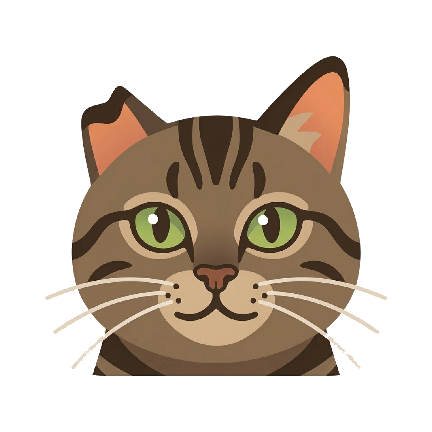

# 莽莽投屏

**Notch Cat Cast** is a small DLNA receiver, with an experimental Airplay URL receiver, for Android TV / Google TV boxes.

  

莽莽 is a tabby cat with a notched ear from a glorious fight. We miss him very much.

## What It Does

Notch Cat Cast publishes a DLNA/UPnP `MediaRenderer` on the local network. Android video apps can discover it as a cast target, send a media URL through `AVTransport`, and let the Android TV device play that URL directly with Media3 ExoPlayer.

It also publishes a minimal Airplay video target for iOS browser players that can hand off a normal MP4 or HLS URL. This path is intentionally narrow: it is for URL playback only, not screen mirroring or protected Apple media playback.

The app was built to replace ad-injecting third-party cast receivers for normal phone-to-TV playback. It is not a Google Cast receiver and does not replace Chromecast's built-in Cast stack.

Current functionality:

- DLNA/UPnP SSDP discovery.
- Minimal `AVTransport`, `RenderingControl`, and `ConnectionManager` SOAP endpoints.
- HTTP/HTTPS MP4 and HLS playback through Media3 ExoPlayer.
- Minimal Airplay `/server-info`, `/play`, `/rate`, `/scrub`, `/stop`, and `/playback-info` endpoints.
- Playback controls for play, pause, stop, seek, mute, and volume when the sender app provides them.
- Full-screen playback with a small bottom status/progress overlay.
- Idle receiver page with service, network, address, and multicast status.
- Foreground media playback service for receiver discovery and request handling.

Tested sender apps:

- Bilibili Android app: discovered the receiver and played direct `bilivideo.com` media URLs.
- Mango TV domestic Android app: discovered the receiver and played through the DLNA path during local testing.
- Youku domestic Android app: discovered the receiver and played through the DLNA path during local testing.
- Tencent Video domestic Android app: discovered the receiver and played after protocol compatibility fixes.
- Google Play variants may prefer Chromecast's built-in Google Cast receiver instead of this DLNA receiver.
- iOS browser Airplay URL playback: implemented for ordinary MP4/HLS handoff, still needs broader real-device coverage.

Most device-side testing was done on a Chromecast with Google TV, but the app is a normal Android TV app and should also run on other Android TV / Google TV boxes that allow local-network discovery and foreground media playback.

## Known Limitations

- This is not a Google Cast or LeLink receiver.
- Airplay support is limited to ordinary URL playback. Screen mirroring, RAOP audio, FairPlay, and DRM playback are not supported.
- DRM streams, encrypted media URLs, and private app-specific request headers are not supported.
- Compatibility is based on the domestic Android video apps tested above, not every DLNA controller.
- Background launch behavior still depends on Android TV system restrictions.
